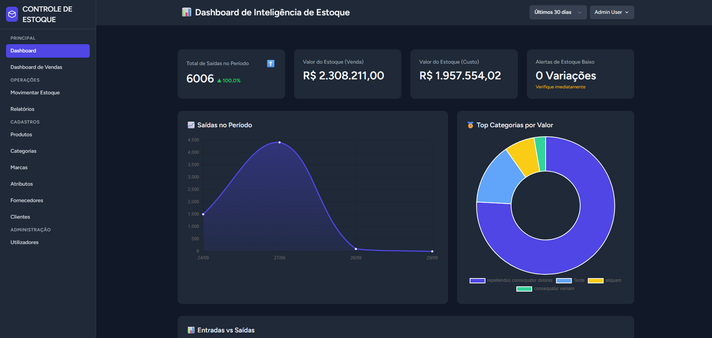
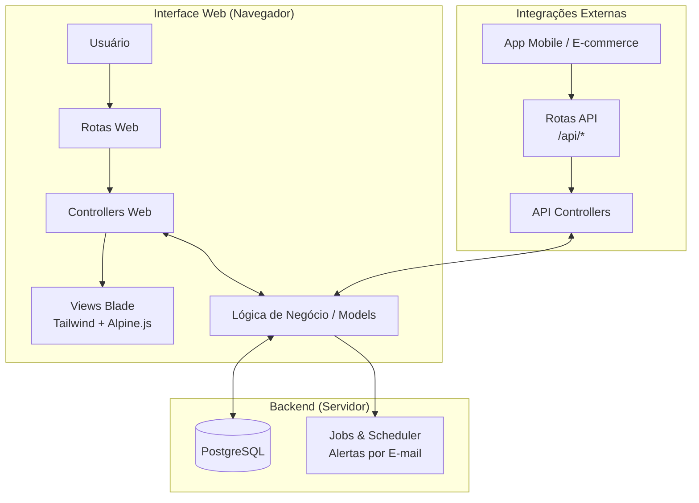

# 📦 Controle de Estoque - Uma Aplicação Web Robusta com Laravel


<p align="center">
  
</p>

<p align="center">
  
  
  
  
  
</p>

## 🎯 Sobre o Projeto

Este projeto é uma aplicação web completa e profissional para **Gestão de Estoque**, desenvolvida do zero com **PHP 8**, **Laravel**, **PostgreSQL** e **TailwindCSS**, aplicando arquitetura **MVC** e boas práticas de mercado. O objetivo foi criar uma solução que não apenas realizasse as operações básicas de um CRUD, mas que também incorporasse as melhores práticas de desenvolvimento, uma arquitetura escalável e funcionalidades de inteligência de negócio para auxiliar na tomada de decisões.

A jornada de criação deste sistema serviu como um profundo campo de estudo e prática, solidificando conceitos de **backend**, **frontend moderno**, **arquitetura de software** e **gestão de banco de dados**.

---

## 🚀 Minha Jornada e Aprendizados

Eu decidi criar este projeto para ir além dos tutoriais básicos e enfrentar os desafios de construir uma aplicação do mundo real. O meu objetivo era claro: dominar o fluxo de trabalho profissional com Laravel e criar um sistema robusto, digno de um portfólio, que demonstrasse competências procuradas pelo mercado.

Durante o desenvolvimento, pratiquei e aprofundei os meus conhecimentos em:
- **Arquitetura MVC:** Organização de código em Models, Views e Controllers.
- **Eloquent ORM:** Relacionamentos complexos (One-to-Many, Many-to-Many), Soft Deletes e Accessors para manipulação de dados.
- **Refatoração de Código:** Migração de uma lógica simples de stock para um sistema avançado de **Lotes e Variações**, demonstrando a capacidade de evoluir a arquitetura do sistema para requisitos de negócio mais complexos.
- **Desenvolvimento de API:** Construção de uma API RESTful segura com **Laravel Sanctum**, pronta para integrações futuras com aplicativos mobile e e-commerce.
- **Frontend Interativo:** Utilização de **JavaScript puro (AJAX/Fetch)** e **Alpine.js** para criar dashboards e formulários dinâmicos que se comunicam com o backend sem recarregar a página.
- **Segurança:** Implementação de permissões de acesso baseadas em papéis (Admin/Operador) com os **Gates** do Laravel, protegendo rotas e elementos da interface.
- **Tarefas Agendadas e Notificações:** Criação de comandos Artisan e automação de alertas de stock baixo por e-mail, utilizando o **Laravel Scheduler**.

Um dos maiores **desafios** foi a depuração de bugs de continuidade que surgiram após grandes refatorações. A persistência em analisar logs, inspecionar o banco de dados e entender a fundo a interação entre o backend e o frontend foi um aprendizado imenso e fundamental.

---

## ✨ Funcionalidades Implementadas

O sistema conta com um ecossistema completo de funcionalidades para uma gestão de stock de nível profissional.

### 🏛 Arquitetura do Sistema



### 📦 Gestão de Produtos e Variações
Cadastro de produtos com um sistema robusto de variações (SKUs), permitindo que cada combinação de atributos (ex: Cor, Tamanho), tenha seu próprio preço, stock mínimo e histórico, mais impressão de etiquetas dos produtos.

### 📈 Controle de Lotes e Validade
Toda a entrada de stock é gerida por lotes com data de validade. As saídas seguem a lógica **FEFO (First-Expire, First-Out)**, garantindo a rotação inteligente do stock e minimizando perdas.

### 🚚 Movimentação e Rastreabilidade
Interface otimizada para registo de entradas e saídas, com suporte a **leitores de código de barras** e associação a **Clientes** e **Fornecedores**, garantindo um histórico de movimentações 100% auditável.

### 📊 Dashboards e Relatórios
- **Dashboard de BI:** Uma visão centralizada com KPIs, tendências, gráficos clicáveis (drill-down) e listas de ação (alertas de stock baixo, produtos parados).
- **Dashboard de Vendas Interativo:** Ferramenta de análise de vendas com busca dinâmica de produtos e atualização de gráficos em tempo real via AJAX.
- **Relatório de Histórico:** Consulta detalhada de todas as movimentações, com filtros avançados.

### 🤖 Automação e Alertas
Sistema proativo que monitoriza o stock e envia **notificações automáticas por e-mail** para os administradores quando um item atinge o seu nível mínimo.

### 🔐 Segurança
- **CSRF e XSS Protection** nativos do Laravel.  
- **Autenticação Sanctum** para API.  
- **Controle de acesso baseado em papéis** (Admin/Operador).  
- **Logs de auditoria** para cada movimentação de estoque.  
- **Rate limiting** em endpoints sensíveis.  

### 🔑 Sessões e Autenticação
- **Login/Logout seguro** com hashing de senhas via **bcrypt**.  
- **Sessões criptografadas** em PostgreSQL/Redis.  
- **Expiração automática de sessão** configurável. 

---

## 🎥 Demonstração das Telas do Projeto

### 🔐 Autenticação
Fluxo de login, registro e atribuição automática de papel de usuário.  
 ---**EM BREVE**---

### 📊 Dashboard
Visão geral do estoque, KPIs e gráficos interativos.  
 ---**EM BREVE**---

### 📦 Gestão de Produtos e Variações
Cadastro, edição, exclusão e impressão de etiquetas.  
 ---**EM BREVE**---

### 📥 Movimentações de Estoque
Entradas e saídas com lógica FEFO e rastreabilidade por lotes.  
 ---**EM BREVE**---

### 🏢 Gestão de Fornecedores
Gerenciamento completo da base de fornecedores.  
 ---**EM BREVE**---

### 👥 Gestão de Clientes
Gerenciamento completo da base de clientes.  
 ---**EM BREVE**---

### 🔑 Gestão de Usuários e Permissões
Alteração de papéis entre **Administrador** e **Operador**.  
 ---**EM BREVE**---

### ⚠️ Cadastros gerais (Categorias, Marcas, Atributos(Gerenciar Valores))
Cadastro, edição e exclusão de dados.  
 ---**EM BREVE**---

---

## 🛠️ Ferramentas e Tecnologias

| Camada | Tecnologia |
|-------|------------|
| Backend | PHP 8.x, Laravel 12.x |
| Banco de Dados | PostgreSQL 14+ |
| Frontend | Blade, TailwindCSS, Alpine.js, Chart.js |
| API | Laravel Sanctum |
| Desenvolvimento | VSCode, DBeaver, Postman |
| Testes de E-mail | Mailtrap.io |

---

## 🚀 Instalação e Configuração

Este guia detalhado irá ajudá-lo a configurar o ambiente e a executar o projeto localmente.

### Pré-requisitos
Antes de começar, garanta que tem as seguintes ferramentas instaladas e a funcionar:
- **Git:** ([Download](https://git-scm.com/downloads))
- **PHP 8.2+:** ([Download para Windows](https://windows.php.net/download/))
- **Composer:** ([Download](https://getcomposer.org/download/))
- **Node.js e NPM:** ([Download](https://nodejs.org/))
- **PostgreSQL:** ([Download](https://www.postgresql.org/download/))
- **Um cliente de banco de dados:** (ex: **DBeaver** ou similar).

> **⚠️ Importante: Configuração do PHP**
> Após instalar o PHP, você precisa de editar o arquivo de configuração `php.ini`. Garanta que as seguintes extensões estão ativadas (removendo o `;` do início da linha):
> ```ini
> extension=gd
> extension=pgsql
> extension=pdo_pgsql
> ```

### **Passo 1: Preparar o Banco de Dados**

1. Abra o seu **cliente de banco de dados** (ex.: **DBeaver**, PgAdmin ou outro de sua preferência).
2. Crie uma **nova base de dados** para o projeto com as seguintes configurações recomendadas:

   * **Nome:** `controle_estoque_db` *(ou outro de sua preferência)*
   * **Codificação (Encoding):** `UTF8`
   * **Collation/Ordenação:** `pt_BR.UTF-8` *(ou utilize o padrão do seu sistema caso não esteja disponível)*

> 💡 **Dica:** No DBeaver, clique com o botão direito sobre a conexão ➜ **Create ➜ Connection**, informe os parâmetros acima e confirme. Dependendo da versão o caminho pode mudar..

### Passo 2: Obter o Código
1.  Navegue no seu terminal para a pasta onde deseja guardar o projeto.
2.  Clone o repositório do GitHub:
    ```bash
    git clone [https://github.com/seu-usuario/seu-repositorio.git](https://github.com/seu-usuario/seu-repositorio.git)
    ```
3.  Entre na pasta do projeto:
    ```bash
    cd seu-repositorio
    ```

### Passo 3: Instalar as Dependências
1.  Instale as dependências do PHP (Laravel, etc.):
    ```bash
    composer install
    ```
2.  Instale as dependências do JavaScript (Tailwind, Alpine, etc.):
    ```bash
    npm install
    ```

### Passo 4: Configurar o Ambiente (`.env`)
1.  Copie o arquivo de ambiente de exemplo. No terminal, execute:
    ```bash
    cp .env.example .env
    ```
2.  Gere a chave de encriptação única para a sua aplicação:
    ```bash
    php artisan key:generate
    ```
3.  **Abra o arquivo `.env`** no seu editor de código (VSCode) e edite as seguintes secções:

    **Configuração do Banco de Dados:**
    ```env
    DB_CONNECTION=pgsql
    DB_HOST=127.0.0.1
    DB_PORT=5432
    DB_DATABASE=controle_estoque_db # O nome que você criou no Passo 1
    DB_USERNAME=seu_usuario_db      # O seu usuário do PostgreSQL
    DB_PASSWORD=sua_senha_db        # A sua senha do PostgreSQL
    ```

    **Configuração do Servidor de E-mail (Mailtrap):**
    - Crie uma conta gratuita em [Mailtrap.io](https://mailtrap.io) para capturar os e-mails de teste.
    - Copie as suas credenciais SMTP e cole-as aqui:
    ```env
    MAIL_MAILER=smtp
    MAIL_HOST=sandbox.smtp.mailtrap.io
    MAIL_PORT=2525
    MAIL_USERNAME=seu_username_mailtrap
    MAIL_PASSWORD=sua_password_mailtrap
    MAIL_ENCRYPTION=tls
    MAIL_FROM_ADDRESS="alertas@meusistema.com"
    MAIL_FROM_NAME="${APP_NAME}"
    ```

### Passo 5: Construir o Banco de Dados e o Link de Armazenamento
1.  **Execute as Migrations:** Este comando irá ler todos os arquivos de migration e construir a estrutura de tabelas no seu banco de dados.
    ```bash
    php artisan migrate
    ```
2.  **Crie o Link Simbólico:** Este comando torna a pasta de uploads (onde as fotos dos produtos são guardadas) publicamente acessível.
    ```bash
    php artisan storage:link
    ```

### Passo 6: Iniciar a Aplicação
Finalmente, vamos iniciar os servidores de desenvolvimento. Você precisará de **dois terminais abertos**.

* **No Terminal 1**, inicie o Vite para compilar os assets de frontend:
    ```bash
    npm run dev
    ```
* **No Terminal 2**, inicie o servidor principal do Laravel:
    ```bash
    php artisan serve
    ```
A aplicação estará agora disponível em `http://127.0.0.1:8000`.

---

## 👨‍💻 Como Utilizar

### Criando o Primeiro Usuário (Administrador)

O sistema foi projetado para ser auto-configurável na primeira utilização.

1.  **Acesse à aplicação** no seu navegador (`http://127.0.0.1:8000`). Você será redirecionado para a página de login.
2.  Clique no link **"Cadastrar"**.
3.  Preencha os seus dados para criar a sua conta.
4.  **Parabéns!** Como você é o primeiro usuário a ser registado, o sistema atribuiu-lhe automaticamente a função de **Administrador (`admin`)**. Isto dá-lhe acesso a todas as áreas, incluindo a "Gestão de Usuários".

Qualquer outra pessoa que se cadastrar a partir de agora será um "Operador" por padrão. Você pode promover outros usuários a `admin` na página "Usuários".

### Populando o Banco com Dados de Teste (Opcional, mas Recomendado)
Se desejar testar a aplicação com um grande volume de dados (produtos, vendas, etc.), você pode executar o "Seeder".

> **Atenção:** Execute este comando **depois** de já ter criado o seu usuário admin.
```bash
php artisan db:seed
```

> **Atenção:** Isto irá popular o banco de dados com dezenas de produtos, categorias, clientes, fornecedores e movimentações de teste, permitindo-lhe explorar os dashboards e relatórios em condições realistas.

### Documentação dos Endpoints da API

A API foi projetada para ser a ponte entre o núcleo de negócio e sistemas externos, como aplicativos mobile ou e-commerce. Todos os endpoints protegidos utilizam **autenticação via Bearer Token**.

### 📌 Uso via Postman (recomendado)

Não precisa criar manualmente endpoints ou payloads. Basta importar a coleção Postman pronta.

#### **Como usar**

1. Abra o Postman.
2. Clique em **Import** → selecione o arquivo `EndPoints-Controle-de-Estoque-API.postman_collection`. Que está na pasta raiz do projeto.
3. Configure a variável `base_url` caso a API não esteja em `http://localhost:8000`.
   - Exemplo: `https://meuapp.render.com`
4. Faça login usando o endpoint `POST /api/login` para obter seu **Bearer Token**.
5. Copie o token e cole na variável `token` da coleção.
6. Todos os endpoints agora estão prontos para uso.

#### **Endpoints disponíveis**

- **Autenticação**
  - `POST /api/login` → obtém token de acesso

- **Produtos**
  - `GET /api/produtos`
  - `POST /api/produtos`
  - `GET /api/produtos/{id}`
  - `PUT /api/produtos/{id}`
  - `DELETE /api/produtos/{id}`

- **Variações de Produto**
  - `POST /api/produtos/{id}/variations`
  - `PUT /api/variations/{id}`
  - `DELETE /api/variations/{id}`

- **Movimentações de Estoque**
  - `POST /api/movimentacoes`

- **Busca**
  - `GET /api/search-by-code/{code}`

- **Dados Mestres (somente leitura)**
  - `GET /api/categorias`
  - `GET /api/marcas`
  - `GET /api/clientes`
  - `GET /api/fornecedores`

> Todos os endpoints protegidos já vêm configurados para usar o **token via Bearer**.

---

## 👩‍🎓 Autoria


> Desenvolvido com 💛 por **Angel Luz**.

Se quiser conversar, colaborar ou oferecer uma oportunidade:

📬 E-mail: [contatoangelluz@gmail.com](mailto:contatoangelluz@gmail.com)  
🐙 GitHub: [@angelluzk](https://github.com/angelluzk)  
💼 LinkedIn: [linkedin.com/in/angelitaluz](https://www.linkedin.com/in/angelitaluz/)  
🗂️Website / Portfólio: [meu_portfolio/](https://angelluzk.github.io/meu_portfolio/) 

---